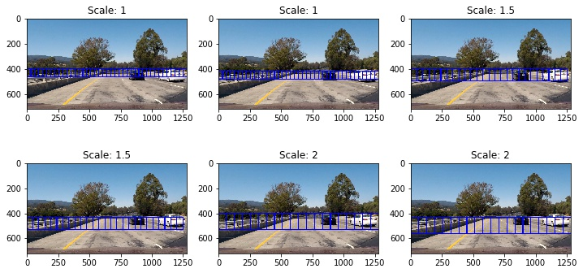

# Vehicle Detection and Tracking

With in this project a simple object detection and tracking pipeline is implemeted to detect cars in a video stream. The outline of the project is as follows:

### 1. Data Visualization
### 2. Feature Extraction
### 3. Training the Support Vector Machine (SVM)
### 4. Sliding Window Approach
### 4. Objection Detection on Images
### 5. Object Detection on Video Stream

In the next couple of paragraph each of the sections will be discussed in detail.

### 1. Data Visualization

The vehicle and non vehicle image data sets were used to train the SVM calssier. This data set contains 8792 images of vehicles and 8968 non-vehicle images. All the images are RGB 64*64 images.The number samples per class in very close that garantees that the trained classifies will not be biased toward any of the classes. The figure below shows some example of images from this data set.

### 2. Feature Extraction
One of the most important stages in a machine learning approach for object detection is feature extraction. Most ideal features should be invarient to ilumination, rotation, scale and translation. Often a combination of different features is poven to be more useful. With in this project I used 3 different features to train the SVM. All the three different features were concatenated and then normalized. Normalization is an essential part to avoid other features with large elements to dominate the others .The selected features are as follows:

**-Color histogram of all 3 channels of the YUV representation of the image**

**-Spatial Binning of Color on YUV color space**

**-Histogram of Oriented Gradient (HOG) applied on the all 3 channels of YUV image** 
The parameters for extracting the HOG features are as follows:

**Orientation = 11**

**Pixels Per Cell = 16**

**Cells Per Block = 2**

### 3. Training the Support Vector Machine (SVM)
After extracting the features and normalization a SVM classifier was trained. I used a **Linear SVM**. The data set was splited to **0.8** for training and **0.2** for testing. The accuracy of the classifier on the test images is **0.991**.

### 4. Sliding Window Approach

For object detection a sliding window approach was used. In the sliding window approach each sub-region of the image which is selected by the window will be resized to the correct format of the training data (64*64) and then the feature vector will be extracted. Afterward the classifier predicts a label for the selected sub-region. Different scale of windows were selected with respect to the training images size (64).

**Scales = 1, 1.5, 2**

**Total number of Windows = 166**

Figure below shows the different window that were used in the object detection pipeline.

