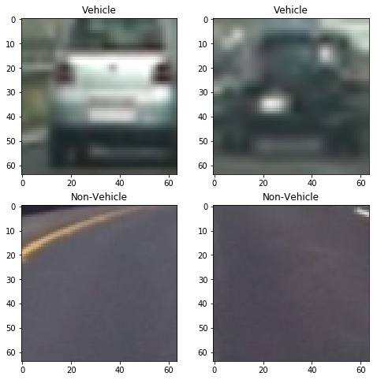
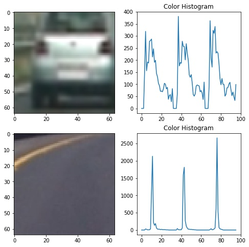
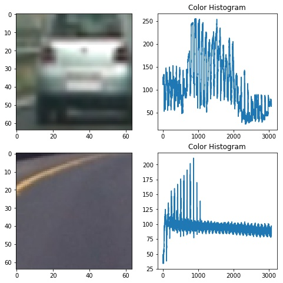
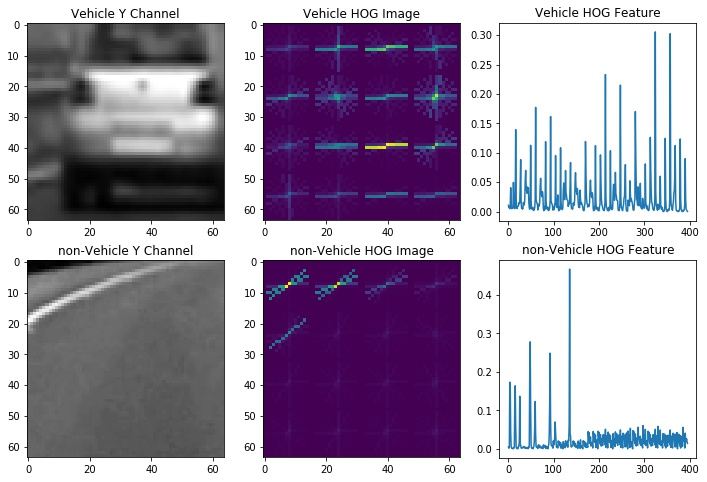

# Vehicle Detection and Tracking

With in this project a simple object detection and tracking pipeline is implemeted to detect cars in a video stream. The outline of the project is as follows:

### 1. Data Visualization
### 2. Feature Extraction
### 3. Training the Support Vector Machine (SVM)
### 4. Sliding Window Approach
### 4. Objection Detection on Images
### 5. Object Detection on Video Stream

In the next couple of paragraph each of the sections will be discussed in detail.

### 1. Data Visualization

The vehicle and non vehicle image data sets were used to train the SVM calssier. This data set contains 8792 images of vehicles and 8968 non-vehicle images. All the images are RGB 64*64 images.The number samples per class in very close that garantees that the trained classifies will not be biased toward any of the classes. The figure below shows some example of images from this data set.

### 2. Feature Extraction
One of the most important stages in a machine learning approach for object detection is feature extraction. Most ideal features should be invarient to ilumination, rotation, scale and translation. Often a combination of different features is poven to be more useful. With in this project I used 3 different features to train the SVM. The selected features are as follows:

**-Color histogram of all 3 channels of the YUV representation of the image**

**-Spatial Binning of Color on YUV color space**

**-Histogram of Oriented Gradient (HOG) applied on the all 3 channels of YUV image** 

