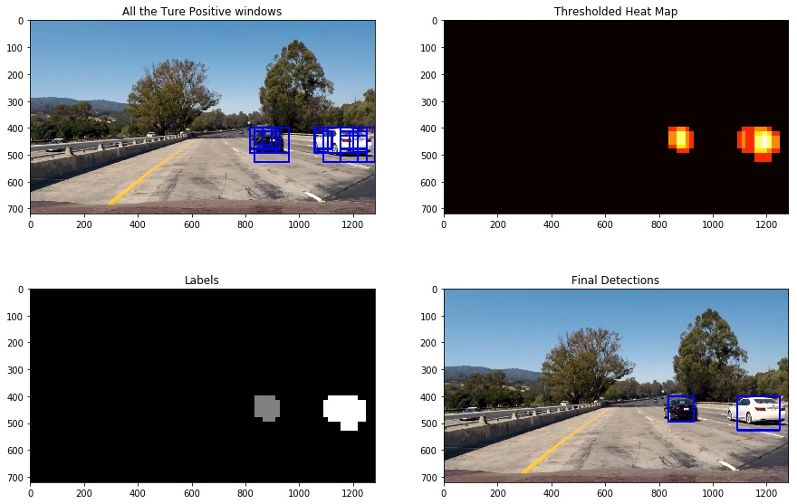
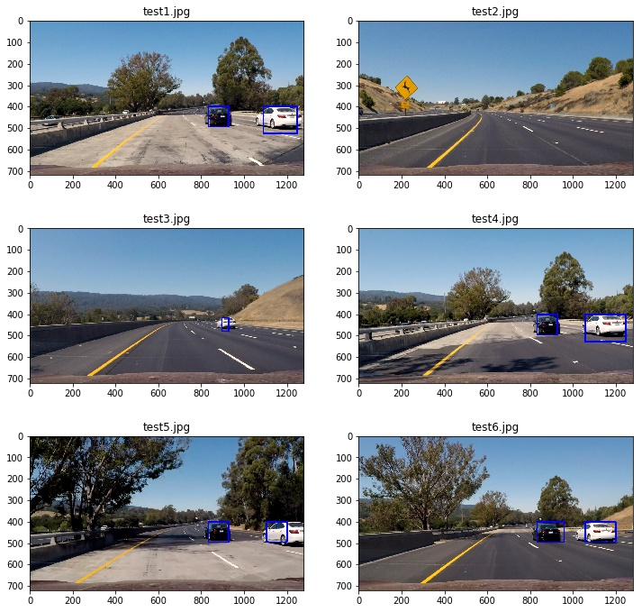

# Vehicle Detection and Tracking

Within this project a simple object detection and tracking pipeline is implemented to detect cars in a video stream. The implementation is available at [Object_Detection.ipynb](https://github.com/Aral-Sarrafi/Object_Detection_and_Tracking/blob/master/Object_Detection.ipynb).The outline of the project is as follows:

### 1. Data Visualization
### 2. Feature Extraction
### 3. Training the Support Vector Machine (SVM)
### 4. Sliding Window Approach
### 4. Objection Detection on Images
### 5. Object Detection on Video Stream
### 6. Discussion

In the next couple of paragraphs, each of the sections will be discussed in detail.

### 1. Data Visualization

The [**vehicle**](https://s3.amazonaws.com/udacity-sdc/Vehicle_Tracking/vehicles.zip) and [**non-vehicle**](https://s3.amazonaws.com/udacity-sdc/Vehicle_Tracking/non-vehicles.zip) image data sets were used to train the SVM classifier. This data set contains 8792 images of vehicles and 8968 non-vehicle images. All the images are RGB 64*64 images. The number of samples per class in very close which guarantees that the trained classifier will not be biased toward any of the classes. The figure below shows some example of images from this data set.

### 2. Feature Extraction

One of the most important stages in a machine learning approach for object detection is feature extraction. Most ideal features should be invariant to illumination, rotation, scale and translation. Often a combination of different features is proven to be more useful. Within this project, I used 3 different features to train the SVM. All the three different features were concatenated and then normalized. Normalization is an essential part to avoid other features with large elements to dominate the others .The selected features are as follows:

**-Color histogram of all 3 channels of the YUV representation of the image**

**-Spatial Binning of Color on YUV color space**

**-Histogram of Oriented Gradient (HOG) applied on the all 3 channels of YUV image** 
The parameters for extracting the HOG features are as follows:

**Orientation = 11**

**Pixels Per Cell = 16**

**Cells Per Block = 2**

### 3. Training the Support Vector Machine (SVM)

After extracting the features and normalization, a SVM classifier was trained. I used a **Linear SVM**. The data set was divided to **0.8** for training and **0.2** for testing. The accuracy of the classifier on the test images is **0.991**.

### 4. Sliding Window Approach

For object detection, a sliding window approach was used. In the sliding window approach, each sub-region of the image which is selected by the window will be resized to the correct format of the training data (64*64) and then the feature vector will be extracted. Afterward the classifier predicts a label for the selected sub-region. Different scale of windows were selected with respect to the training images size (64).

**Scales = 1, 1.5, 2**

**Total number of Windows = 166**

Figure below shows the different window that were used in the object detection pipeline.

### 4. Objection Detection on Images

For all the different sub-regions of the image, the same features will be extracted and normalized, and then the SVM classifier predicts if the window contains a vehicle or not. This procedure is implemented in the function **filter_windows**. Normally, the prediction will contain several **False-Positive** detections which needs to be filtered out. In order to filter the false-positive detections I used two different thresholding methods as follows:

**1.Detection Confidence:** SVM makes the decisions based on the decision boundary or the hyperplane, and the False-Positive detections are normally have a small distance to this hyper plane. I used a threshold to filter-out some the False-Positives. (This method is embedded in the **filter_windows** function.

**2. Heat map threshold:** The heat map approach is serving for two purposes in this object detection pipeline. 

**Filtering False Positives:** Normally the True-Positive detections are companied with couple of other detection from other windows, while the False-Positives are not. Therefore, applying a threshold on the heatmap can filter out the False-Positives.

**Merging the Multiple Detections:** As mentioned earlier the objects will be detected in different overlapping windows, and the windows should be combined together to a single detection. This procedure can be also accomplished by a heat map. Once the heat map is formed the **label** function will operate on it. The label function checks for the connected sub-regions in the image considering a connectivity matrix, and generates the labels, which will be the final detection. Figure below shows the different stages of the vehicle detection.

Figure below shows the final detection results for the test images, as it is clear the pipeline is able to detect the vehicles in all the test images. This indicates that the pipeline might be able to detect the vehicles and track them in a video as well.

### 5. Object Detection on Video Stream

The same procedure for object detection on images can be applied to the frames of a video. Moreover, in videos the detections from the previous frames can be used to improve the detection. In this implementation I applied a threshold on a heat map for **15 frames** of the video to increase the accuracy of the pipeline. Other advance methods such as Kalman filter can be also added to the pipeline to increase the accuracy and to provide smooth tracking. Moreover, in videos the search area and windows can be selected based on the previous frames that can also increase the accuracy and reduce the pipeline response time. The [**My_result.avi**](https://github.com/Aral-Sarrafi/Object_Detection_and_Tracking/blob/master/My_video.avi) and [**test_reult.avi**](https://github.com/Aral-Sarrafi/Object_Detection_and_Tracking/blob/master/test_result.avi) are some the results of the designed pipeline for vehicle detection and tracking. The gif below also shows some the results obtained from this pipeline. There are some detections from the other lane (passing cars in the left lane), which can be filtered out by a better selection of search region and playing with threshold values.

### 6. Discussion

Within this project an object detection and tracking pipeline was implemented in python. **Color histogram**, **spatial bin** , and **HOG features** on all channels of the **YUV** image was used as features for detection. A **Support Vector Machine (SVM)** was trained on labeled data set to detect vehicles from non-vehicle images. A sliding window approach was implemented for object detection and searching in the image for the vehicles. A heat map approach was used to filter out some of the outliers and also to combine the multiple detections of the same object.

The major challenge that I faced in this project was filtering the False-Positives. The False positives were handled by thresholding the heat map image and also filtering the detection with low detection confidence. For future work, some improvements can be considered for the pipeline:

**1. Using other vehicle and non-vehicle data set to increase the generality of the trained SVM**

**2. Adding a Kalman-Filter estimator to the video processing pipeline to make the predictions more accurate and smoother**

**3. Using more advanced features such as SIFT**

**4. Deep Learning approaches can considered instead of SVM
